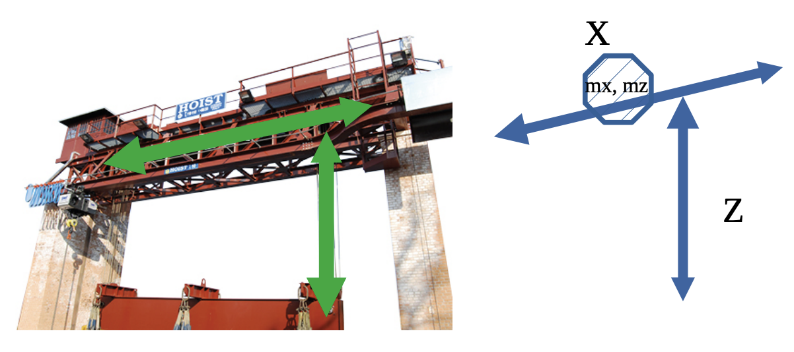

[Advanced and Robot Programming](https://corsi.unige.it/en/off.f/2022/ins/60228?codcla=10635)<br>
**Programmer:** [Ankur Kohli](https://github.com/ankurkohli007)<br>
[M.Sc Robotics Engineering](https://corsi.unige.it/corsi/10635)<br>
[University of Genoa (UniGe)](https://unige.it/en)<br>
**Supervisor:** [Prof. Renato Ugo Raffaele Zaccaria](https://rubrica.unige.it/personale/VUFOXVhs) & [Prof. Simone Macciò](https://rubrica.unige.it/personale/UUNAWFho)

## Hoist Simulator

Base project structure for the first Advanced and Robot Programming (ARP) assignment. The project provides the basic functionalities for the Command and Inspection consoles. 

The code was design, develop, test and deploy is an interactive simulator of hoist with 2 d.o.f, in which two different consoles allow the user to activate the hoist. Figure below is structure which highlights the hoist cotrol to accomplish the task.



In the octagonal box there are two motors mx and mz, which displace the hoist along the two respective axes. Motions along axes have their bounds, say 0 - max_x and 0 - max_z. 

From the user side there are two consoles (shell windows) and keys with different aims, that simulate a real system.

There were two consoles i.e. Command Consoles & Inspection Consoles, also mentioned above. Below are the brief description about the two consoles.

**Command Console:** It comprises of buttons which can be accesed by the user to control the hoist as shown in figure above. Features of the buttons are given below: 

* X axis increase
* X axis decrease
* X axis stop
* Z axis increase
* Z axis decrease
* Z axis stop

In the aforementioned features, X terms indicated to Motor X and Z terms indicated to Motor Z.

**Inspection Console:** It comprises of two buttons such as button *S* & *R*. The fucntions of these buttons are mentione below:

* **S:** emergency stop, the joist stops immediately until a command from the first console arrives.
* **R:** reset, the joint stops, both axes go to a zero position and wait for commands.

The simulator has 5 process such as: 

* **Command Console**, reading the 6 commands, for instance using keyboard keys or inputs are chosen according to our choice.
* **Inspection Console**, receiving from motors the hoist positions while it moves, and reporting on the screen somehow (as per our choice); the inspection console manages the S ad R buttons as well (simulated in a free way using the keyboard).
* **Motor X**, simulating the motion along x axis, receiving command and sending back the real time position.
* **Motor Z**, simulating the motion along Z axis, receiving command and sending back the real time position.
* **Watchdog:** it checks the previous 4 processes periodically, and sends a reset (like the R button) in case all processes did nothing (no computation, no motion, no input/output) for a certain time, let's say 60 seconds.

**Specification of Motor X & Z**

The motor process simulates the constant speed motion, including a simple error in position measurement. It receives a command (move, stop, go to zero position), acts, sends back a position estimate, stops when the end displacement is reached. here is a rough sketch of the motor loop:

```c
last command = stop
loop [
update/receive command
if ( command == reset ) <reset procedure>
if ( command != stop || ~(position == displacement_end) ) [
position += step
estimated position = position + error
<send estimate position>
]
sleep (dt)
]
```

## Running ##

Inside the .zip archive are contained five files, three shell scripts the sources.zip archive and the text file you are reading. In the sources archive you find 6 directories wich contain the .c file and also a .txt file with  informations about each process.

First of all to unzip the sources archive and install the program using the command:

```
source ./install.sh <pathname>
```

It will create a folder called <pathname> inside which are located the folders that were in sources.zip, there will also be a folder with the executables of each process.
  
After that run the program with the command:

```
./run.sh
```
  
Each of this process has a section in which a signal is sent to the watchdog timer to prove they're functioning.
